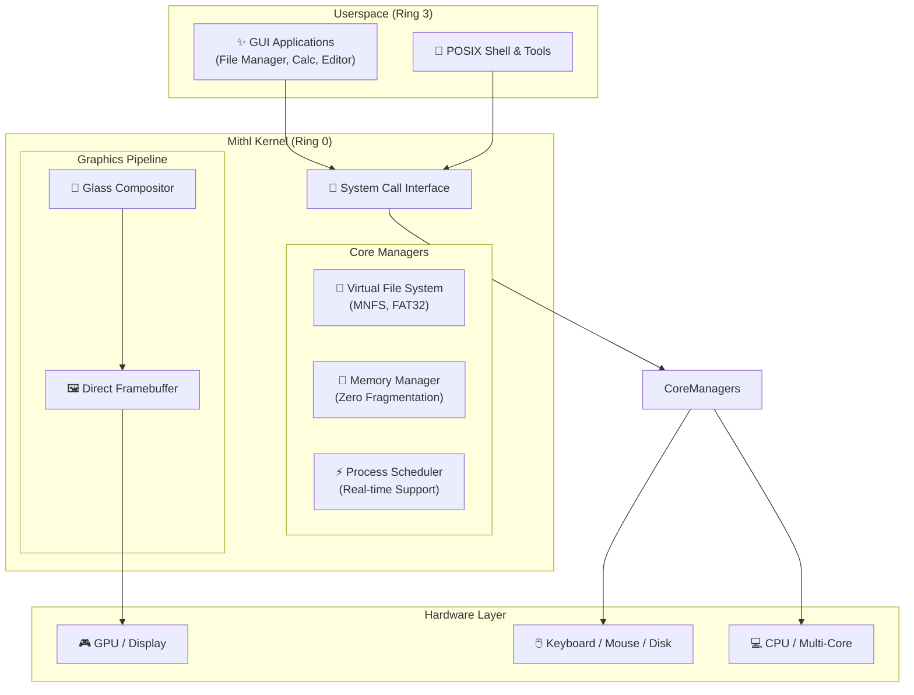
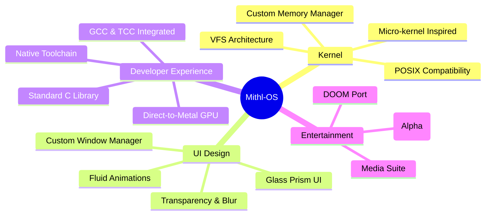

<div align="center">

<h1 align="center">
  
  Mithl-OS
</h1>
### The Modern Operating System for Creators

✨ **Fast. Beautiful. Yours.** ✨

[](https://github.com/DoguparthiAakash/Mithl/)
[](https://github.com/DoguparthiAakash/Mithl/)
[](https://doguparthiaakash.github.io/Mithl/)

---

</div>

## 🌌 Overview

**Mithl-OS** is a high-performance, independent operating system built from scratch with a singular vision: **Speed, Aesthetics, and Control**. Designed from the ground up, it eliminates decades of legacy bloat to provide a premium, distraction-free environment for creators and developers.

> [!TIP]
> **Mithl-OS is invisible.** It stays out of your way, boots instantly, and provides the raw performance you need to build your dreams.

---

## 🏗️ System Architecture

Mithl-OS features a streamlined, high-efficiency architecture designed for direct hardware access and maximum stability.



---

## 🎯 Ecosystem Mindmap



---

## ⚡ Core Philosophy

| Pillar | Description |
| :--- | :--- |
| **Performance** | Direct-to-metal graphics and optimized scheduling for zero lag. |
| **Stability** | Micro-kernel inspired isolation ensures system uptime. |
| **Aesthetics** | Premium "Glass Prism" design language for a modern workspace. |
| **Independence** | Built from scratch—no Linux, no legacy, no bloat. |

---

## 🚀 Getting Started

### 📦 Download Latest Release
Releases are hosted on our dedicated distribution portal:

**[Visit Releases Page](https://github.com/DoguparthiAakash/Mithl/releases)**

> [!IMPORTANT]
> Always use the latest ISO for the best experience. Previous versions may lack critical security and performance updates.

### 🛠️ Quick Boot (QEMU)
```bash
# Launch Mithl-OS instantly
qemu-system-x86_64 -cdrom iso/Mithl-latest.iso -m 512M
```

### 💾 Flash to Hardware
```bash
# ⚠️ CAUTION: Replace /dev/sdX with your actual USB device
sudo dd if=iso/Mithl-latest.iso of=/dev/sdX bs=4M status=progress && sync
```

---

## 🤝 Join the Development Team

Mithl-OS development happens in a **Private Repository** to maintain elite quality and security. We are looking for kernel hackers, UI visionaries, and documentation artists.

> [!NOTE]
> Approved contributors get access to 🔑 Private Source Code, 📚 Internal Docs, and 👥 Core Dev Team.

**[Apply to Contribute](https://doguparthiaakash.github.io/Mithl/contribute.html)**

---

<div align="center">

*Mithl-OS: Fast. Beautiful. Yours.*

**Built with ❤️ by Independent Developers**

</div>
