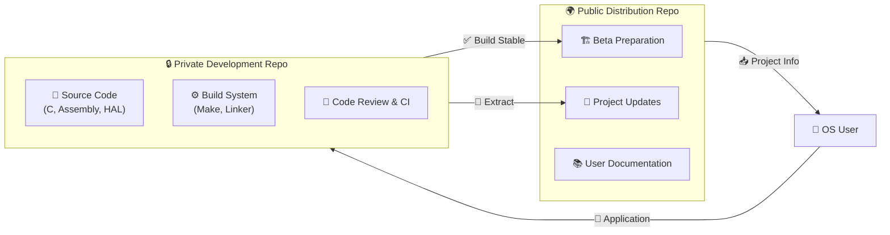

<div align="center">
  <h1 align="center">
     Repository Architecture & Restructuring
  </h1>
</div>

Mithl-OS has transitioned to a **Dual-Repository Model**. This strategic move ensures elite code quality, security, and a professional development environment while maintaining seamless accessibility for end-users.

---

## 🏛️ The Dual-Repository Model



---

## 📊 Infrastructure Comparison

| Feature | 🔒 Private Dev Repo | 🌍 Public Dist Repo |
| :--- | :--- | :--- |
| **URL** | `https://github.com/.../Mithl` | `https://github.com/.../Mithl` |
| **Access** | 🔑 Approved Contributors | 👥 Everyone |
| **Primary Content** | Full Source Code & Toolchain | Pre-built ISOs & User Docs |
| **Visibility** | Hidden from Public | Fully Public |
| **Purpose** | Active Development | Distribution & Usage |

---

## ⚡ Contribution Workflow

Interested in building the future of OS? Follow our elite onboarding process.

```mermaid
stepper
  step 1 : "Visit [Contribute Page](https://doguparthiaakash.github.io/Mithl/contribute.html)"
  step 2 : "Fill Application Form (Skills, Motivation, Portfolio)"
  step 3 : "Internal Review (3-5 Business Days)"
  step 4 : "Receive 🔑 Private Access & Onboarding Docs"
  step 5 : "Start Contributing to Core!"
```

> [!IMPORTANT]
> **Why Private?** OS development requires high-integrity code review. Our private model ensures every line of code meets our strict performance and security standards before it ever reaches a public release.

---

## 📦 User Journey (Stay Tuned)

Mithl-OS is currently in its elite development phase. Here is how you can stay involved:

1.  **Follow** the project on [GitHub](https://github.com/DoguparthiAakash/Mithl/) for progress updates.
2.  **Explore** the [Features](https://doguparthiaakash.github.io/Mithl/features.html) page to see what's being built.
3.  **Apply** to join the core team if you have systems programming or design expertise.
4.  **Watch** for the first public beta announcement!

---

## 📝 Change Log Summary

The following files have been synchronized with the new repository architecture:

- `index.html`: Updated navigation to point to public distributions.
- `contribute.html`: Redesigned with a professional application form.
- `README.md`: Transformed into a high-impact project presentation.
- `REPOSITORY_RESTRUCTURING.md`: Detailed architecture documentation.

---

<div align="center">

*Professional. Secure. Open for Visionaries.*

**Mithl-OS Team**

</div>
